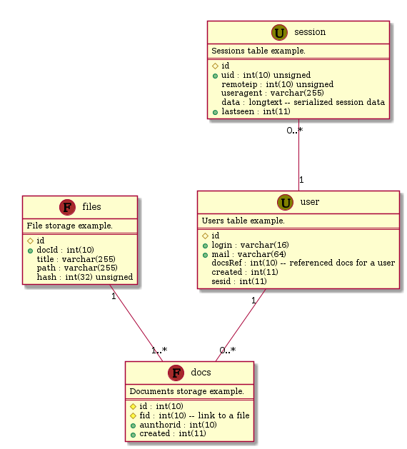

# plantuml2mysql

I liked `plantuml` tool for UML diagrams but use it
also for visualizing structure of relational database.
This script loads plantuml class diagram and generates
DDL for MySQL SQL dialect. You may define primary keys
with `#` prefix in field name (it mean protected field
in PlantUML) and define index fields with `+` prefix.

Field type noted after field name as is. Also you may
use comments after `--`.

For example class definition:

    @startuml

    class dummy {
      Sample table.
      ==
      #id int(10)
      field1 int(10)
      field2 varchar(128)
    }

    @enduml

will be converted to SQL:

    CREATE TABLE IF NOT EXISTS Dummy (
      id               INT(10),
      field1           INT(10),
      field2           VARCHAR(128),
      PRIMARY KEY (id));

Text between class name and `==` is table description.
The description of the table is mandatory.
I was too lazy to check for absence of descriptions but
I not lazy to write them in each table of my databases.

See below result of more complicated sample from [database.plu](database.plu):



```./plantuml2mysql.py database.plu sampledb```

```sql
    CREATE DATABASE sampledb CHARACTER SET = utf8 COLLATE = utf8_unicode_ci;
    USE sampledb;                                                           
                                                                            
    CREATE TABLE IF NOT EXISTS user (                                       
      id               SERIAL,                                              
      login            VARCHAR(16),                                         
      mail             VARCHAR(64),                                         
      docsRef          INT(10) COMMENT 'referenced docs for a user',        
      created          INT(11),                                             
      sesid            INT(11),                                             
      PRIMARY KEY (id),                                                     
      INDEX (login),                                                        
      INDEX (mail)                                                          
    );                                                                      
                                                                            
    CREATE TABLE IF NOT EXISTS session (                                    
      id               SERIAL,                                              
      uid              INT(10) UNSIGNED,                                    
      remoteip         INT(10) UNSIGNED,                                    
      useragent        VARCHAR(255),                                        
      data             LONGTEXT COMMENT 'serialized session data',          
      lastseen         INT(11),                                             
      PRIMARY KEY (id),                                                     
      INDEX (uid),                                                          
      INDEX (lastseen)                                                      
    );                                                                      
                                                                            
    CREATE TABLE IF NOT EXISTS docs (                                       
      id               INT(10),                                             
      fid              INT(10) COMMENT 'link to a file',                    
      aunthorid        INT(10),                                             
      created          INT(11),                                             
      PRIMARY KEY (id, fid),                                                
      INDEX (aunthorid),                                                    
      INDEX (created)                                                       
    );                                                                      
                                                                            
    CREATE TABLE IF NOT EXISTS files (                                      
      id               SERIAL,                                              
      docId            INT(10),                                             
      title            VARCHAR(255),                                        
      path             VARCHAR(255),                                        
      hash             INT(32) UNSIGNED,                                    
      PRIMARY KEY (id),                                                     
      INDEX (docId)                                                         
    );                                                                      
```

I just not need yet more features and satisfied with this code as is
but I'll merge your patches if you create something completely different.


